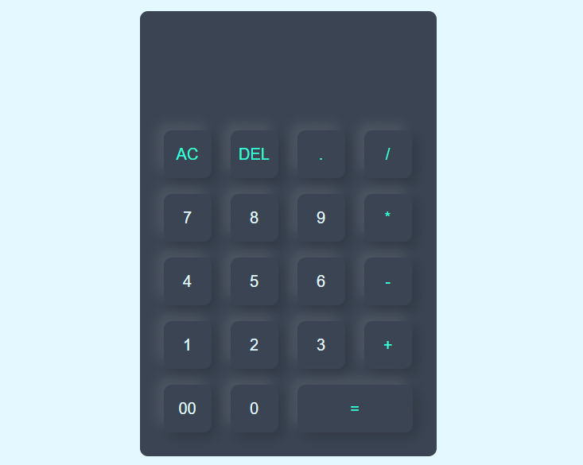

# Calculater
# Web Calculator

This is a simple web calculator project built using HTML, CSS, and JavaScript.

## Description

This calculator allows users to perform basic arithmetic operations such as addition, subtraction, multiplication, and division. It features a user-friendly interface with buttons for each digit and operator, as well as a display screen to show the input and result.

## Features

- Addition
- Subtraction
- Multiplication
- Division
- Clear button to reset the calculator
- Responsive design for use on various screen sizes

## Demo

You can try out the calculator live [here](https://prathmeshpol2004.github.io/Calculater/).

## Screenshots

